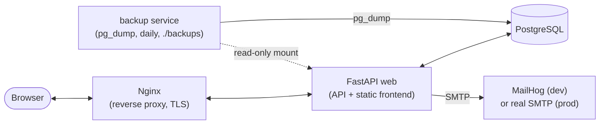
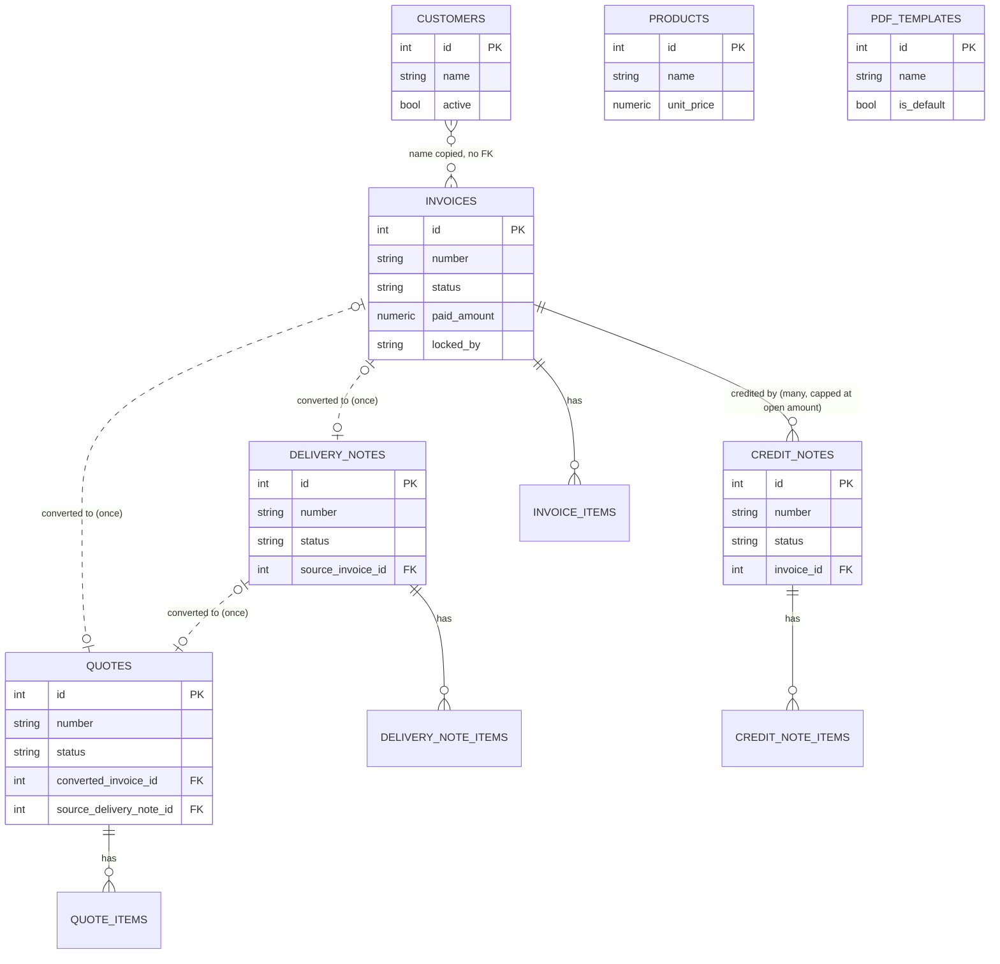
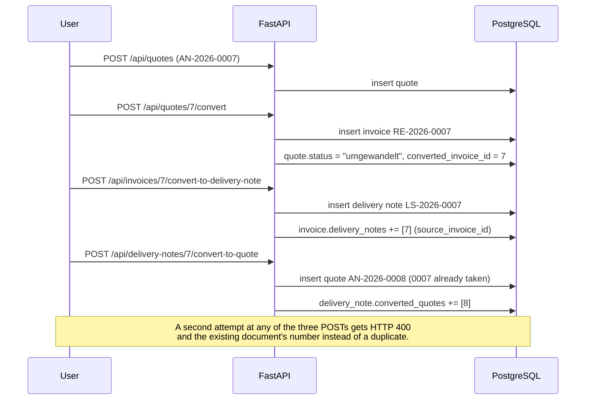
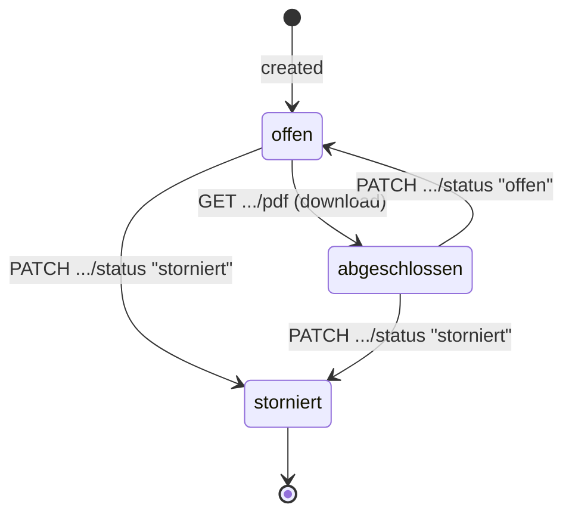
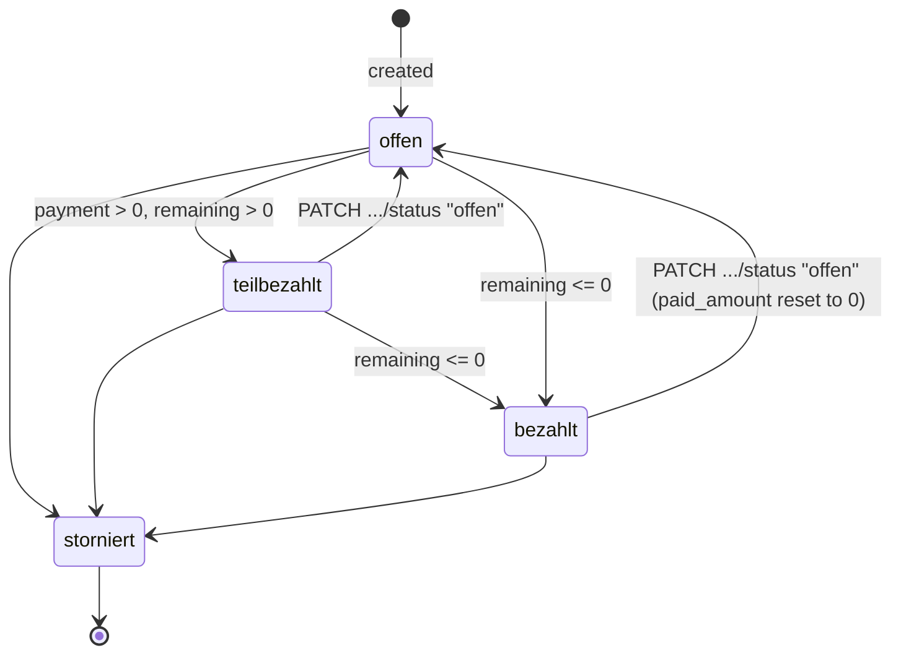
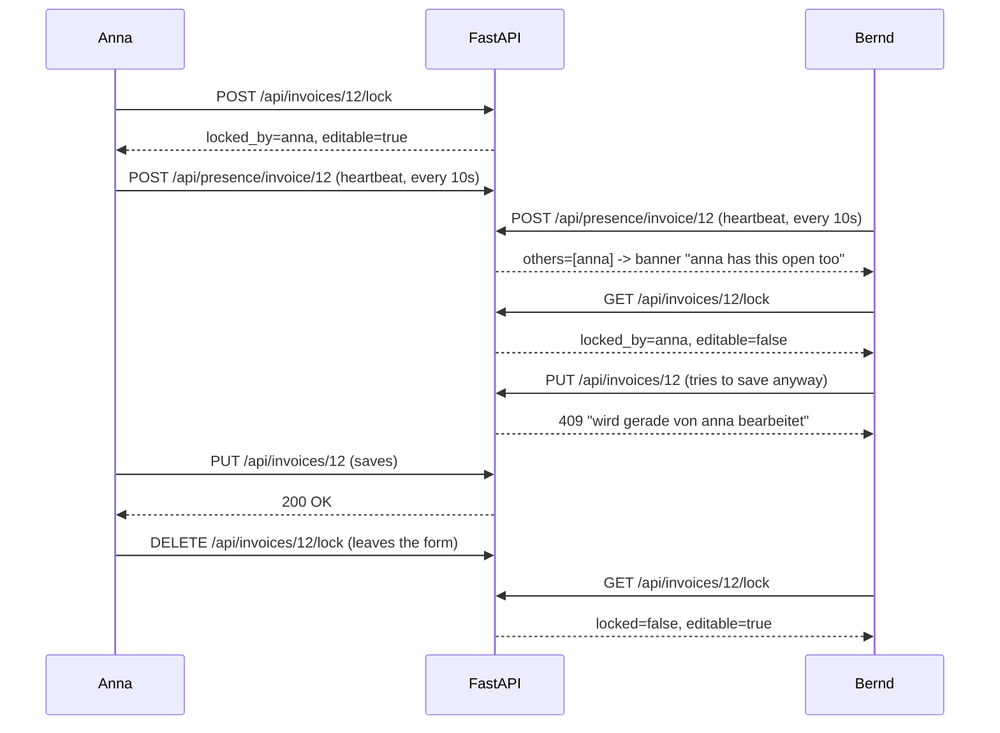

================================================================================
RECHNUNGS-APP - TECHNICAL DOCUMENTATION
================================================================================

+---------------------+
| 🏗 SYSTEM OVERVIEW  |
+---------------------+

ARCHITECTURE:
┌─────────┐    ┌─────────┐    ┌─────────┐    ┌─────────┐    ┌─────────┐
│ Client  │ →  │ Nginx   │ →  │ FastAPI │ →  │ Postgres│    │ MailHog │
└─────────┘ ←  └─────────┘ ←  └─────────┘ ←  └─────────┘    └─────────┘
                                    │
                                    └────────── SMTP ────────→ (or real
                                                                mail provider
                                                                in prod)
               ┌─────────┐
               │ Backup  │ (pg_dump, daily, → ./backups, read by web
               └─────────┘  container for admin list/download/restore)

The `web` container serves both the JSON API and the static frontend
(vanilla JS/HTML/CSS under `backend/app/static`) from the same FastAPI app.
There is no separate frontend build step or framework.

The same picture as a diagram, with the backup service's relationship to the
database and the `web` container made explicit (it writes dumps, `web` only
reads them for the admin backup UI):

TECHNOLOGY STACK:
+------------+-------------------+-----------------------------------------+
| Component  | Technology        | Purpose                                  |
+------------+-------------------+-------------------------------------------+
| Backend    | Python 3.12/FastAPI/SQLAlchemy | Business logic, REST API   |
| Database   | PostgreSQL 16     | Data persistence                         |
| Frontend   | Vanilla JS/HTML/CSS | UI, served as static files by FastAPI  |
| PDF        | ReportLab + qrcode | Invoice/quote/delivery-note/credit-note PDFs + GiroCode, styled by a PDF template |
| Email      | smtplib -> MailHog (dev) or real SMTP (prod) | Sending documents/reminders |
| Proxy      | Nginx             | Host-based reverse proxy, HTTP + HTTPS   |
| Container  | Docker Compose    | 5 services: web, db, mailhog, proxy, backup |
| Tests/CI   | pytest + httpx, node:test + jsdom, GitHub Actions | 249 backend + 102 frontend tests, static checks, image build |
+------------+-------------------+-------------------------------------------+

DEPLOYMENT:

Guided scripts (recommended):
  scripts/setup-test.sh   -> quick local test instance, self-signed cert,
                              random test credentials, no real email
  scripts/setup-prod.sh   -> interactive: generates strong SESSION_SECRET
                              and DB password, optionally configures real
                              SMTP credentials and requests a Let's Encrypt
                              certificate via certbot (falls back to the
                              existing self-signed cert if certbot is
                              unavailable or no domain is given)

Manual steps:
1. Generate a self-signed dev cert:
   openssl req -x509 -nodes -days 365 -newkey rsa:2048 \
     -keyout nginx/certs/localhost.key \
     -out nginx/certs/localhost.crt \
     -subj "/CN=localhost"

2. Configure .env (see .env.example):
   POSTGRES_USER=rechnung
   POSTGRES_PASSWORD=securepassword
   APP_USERS=admin:admin,anna:passwort
   SESSION_SECRET=<random, change in production>

3. Start services:
   docker compose up --build

On startup, `on_startup()` in `main.py` calls `init_db()`, which waits for
Postgres to become reachable, creates all tables via SQLAlchemy metadata, and
runs a list of idempotent `ALTER TABLE ... ADD COLUMN IF NOT EXISTS`
statements (`database.py::_MIGRATIONS`) so existing deployments pick up new
columns without a dedicated migration tool (no Alembic). `seed_users()` then
creates the admin + APP_USERS accounts, but only if the `users` table is
still empty (i.e. only on the very first start).

ACCESS POINTS:
+----------------------------+-------------------+------+---------------------+
| URL                        | Service           | Port | Notes               |
+----------------------------+-------------------+------+---------------------+
| http://rechnungen.localhost| Main Application  | 80   | via nginx            |
| https://rechnungen.localhost| Main Application | 443  | self-signed by default, or Let's Encrypt via setup-prod.sh |
| http://mail.localhost      | MailHog           | 80   | via nginx, dev email testing |
| http://localhost:8000      | Main Application  | 8000 | direct, bypasses proxy |
| http://localhost:8025      | MailHog           | 8025 | direct, bypasses proxy |
+----------------------------+-------------------+------+---------------------+

DATABASE SCHEMA (SQLAlchemy models in backend/app/models.py):
+------------------+---------------------------------------------------------+
| Table            | Key Fields                                               |
+------------------+---------------------------------------------------------+
| users            | id, username, password_hash (PBKDF2), is_admin          |
| customers        | id, name, address, contact_person, email,               |
|                  | payment_term_days, skonto_percent, skonto_days, active   |
| products         | id, name, unit_price, active                             |
| invoices         | id, number (RE-YYYY-NNNN), customer_name/address/contact,|
|                  | issue_date, due_date, tax_rate, status, paid_amount,     |
|                  | skonto_percent/days, discount_percent, small_business,   |
|                  | locked_by, locked_at, cancelled_at                       |
| invoice_items    | id, invoice_id, description, quantity, unit_price        |
| quotes           | id, number (AN-YYYY-NNNN), customer_*, valid_until,      |
|                  | tax_rate, discount_percent, small_business, status,      |
|                  | converted_invoice_id                                     |
| quote_items      | id, quote_id, description, quantity, unit_price          |
| delivery_notes   | id, number (LS-YYYY-NNNN), customer_*, status,           |
|                  | source_invoice_id                                        |
| delivery_note_items | id, delivery_note_id, description, quantity            |
| credit_notes     | id, number (GS-YYYY-NNNN), invoice_id, customer_*,       |
|                  | issue_date, reason, tax_rate, small_business, status     |
| credit_note_items | id, credit_note_id, description, quantity, unit_price   |
| pdf_templates    | id, name, accent_color, header_color, font_family,       |
|                  | font_size, header_note, footer_text, show_logo, show_qr, |
|                  | is_default                                               |
| settings         | id (=1, single row), company_name, address, tax_id,      |
|                  | vat_id, iban, bic, email, phone, logo, logo_mime          |
| audit_log        | id, timestamp, username, action, target_type, target_id, |
|                  | detail                                                    |
| presence         | id, doc_type, doc_id, username, last_seen                 |
|                  | (unique per doc_type+doc_id+username; short-lived)        |
+------------------+---------------------------------------------------------+

Invoices, quotes and delivery notes share ONE per-year sequence number
(`crud._next_doc_suffix`), taking the max suffix across all three tables so a
quote converted to an invoice, or an invoice converted to a delivery note,
can carry the same running number forward with just the prefix changed
(e.g. AN-2026-0007 -> RE-2026-0007 -> LS-2026-0007). Number assignment is
serialized with a PostgreSQL advisory transaction lock
(`pg_advisory_xact_lock`, fixed key) so concurrent users never collide.

The tables and their relationships as an ER diagram (attributes trimmed to
the ones that carry a relationship or explain the row; the full column list
is the table above). `customer_name`/`customer_address`/`customer_contact_person`
on every document are a *copy* taken at creation time, not a foreign key to
`customers` – a later edit or anonymization of the customer record does not
change wording on an already-issued document:

CREDIT NOTES:
A credit note (`GS-YYYY-NNNN`, `crud.create_credit_note`) is its own document
type, not a status on the invoice – an invoice can be credited in several
steps. It shares the per-year number sequence with the other three. Linked to
an invoice through `credit_notes.invoice_id`, it lowers that invoice's open
amount: `Invoice.remaining = total − paid_amount − credited_amount`, where
`credited_amount` sums the non-cancelled credit notes (relationship with
`lazy="selectin"`). `POST /api/invoices/{id}/credit-note` builds one from the
invoice – all items (full) or the posted ones (partial), with the invoice's
discount folded into the unit prices – and refuses anything above the open
amount, deleting the just-created note again so nothing half-done remains.
The invoice status is deliberately NOT flipped to "bezahlt" by a credit note:
credited is not paid. Dashboard revenue subtracts credited amounts.

PDF TEMPLATES:
`pdf.py` renders all four document types from shared building blocks
(`_company_header`, `_head_table`, `_customer_block`, `_priced_items_table`,
`_footer_factory`), all parameterised by `pdf._Layout` – the resolved
template. Without a template, `pdf.DEFAULTS` reproduces the previous
hard-coded look exactly. A `pdf_templates` row carries colours, one of the
three built-in PDF font families (no font embedding), size, header/footer text
and the logo/GiroCode switches; exactly one row is `is_default`.

Startup seeds three ready-made templates (`crud.seed_pdf_templates`, called
from `main.on_startup` next to `seed_users`) instead of leaving a fresh
install with nothing to pick from: two "standard"-layout presets, "Klassisch
Blau" (`pdf.DEFAULTS`'s own colours/font, so it becomes the default on an
empty table – `create_pdf_template` makes the first-ever row `is_default`)
and "Modern Dunkel" (different accent/header colour and font), plus the
pre-printed form as "Mechatronik Neubauer e.U." with layout "formular". Each
of the three is seeded independently (`_seed_standard_templates` by name,
`_seed_form_template` by the presence of any "formular"-layout row) so a
renamed or deleted one is never re-created under the same name, and a
hand-made template of your own is left alone.

A template also picks one of two layouts (`pdf.LAYOUTS`, column `layout`).
"standard" is the Platypus flow above; "formular" hands the document to
`pdf_form.py`, which redraws the company's pre-printed form on a bare canvas:
banner, sender block, the four tick boxes (quote / order / delivery note /
invoice – a credit note relabels the invoice row so its number cannot be
mistaken for one), the item box with its four columns and the three sum
boxes. All coordinates are given in pixels of the original 641x1088 scan
(`_x()`/`_y()`, A4 with 17.5 mm side margins), so any line can be re-measured
against the original. Items wrap inside the description column and overflow
onto further pages; the sums are printed on the last one. Payment terms,
skonto and what has already been settled go into the small print at the
bottom, where the form has room for them – there is no GiroCode in this
layout. Every PDF
endpoint takes `?template=<id>` (`main.pdf_template` resolves explicit id ->
default -> None), and `/api/pdf-templates/{id}/preview` renders a sample
invoice built in memory, so a template can be judged without touching real
data.

REPORTS:
`reports.py` computes both analyses from the same base: non-cancelled
invoices by issue date minus non-cancelled credit notes by issue date (accrual
basis). `vat_report` buckets net/tax/gross per tax rate – small-business
documents land in the 0 % bucket – and `revenue_report` aggregates per month
and per customer plus paid/open. Both have a CSV twin (semicolon, German
decimal commas, BOM). Neither knows expenses: the app does not track them, so
the VAT report carries `input_tax_known: false` and the revenue report
`expenses_tracked: false` rather than pretending to be a P&L.

`custom_report()` is the third, open-ended analysis: one of the four document
types, a period, an optional status filter, grouped by nothing (a plain
document list), customer, month, or status. Unlike the two fixed reports it
does not exclude anything on its own – a cancelled document counts unless the
caller filters it out via `status` – because "free" here means the caller
decides, not the report. `_HAS_AMOUNTS` is `False` for delivery notes (they
carry no prices); the response then omits `net`/`tax`/`gross` entirely
(`has_amounts: false`) rather than sending zeros that would look like real
figures. Routes: `GET /api/reports/custom` and its `.csv` twin, both under
`/api/reports/` and therefore covered by the response cache below.

RESPONSE CACHE:
`cache.py` holds the response of `/api/stats` and everything under
`/api/reports/` (JSON and CSV alike) in process memory for
`CACHE_TTL_SECONDS` (default 30 s), returned with an `X-Cache: HIT` header;
a fresh computation is `X-Cache: MISS`. Registered as the innermost
middleware – right before the route, after the login check – so a cache hit
still goes through authentication and picks up the usual security/request-ID
headers on the way back out (see MIDDLEWARE ORDER below). Only those few
computation-heavy endpoints are cached; document and master-data lists are
deliberately left out, because several users work on them live (presence,
edit lock) and a stale answer there costs more than the milliseconds a plain
indexed query saves. A successful write to `/api/invoices`, `/api/credit-notes`
or `/api/admin/backups` clears the whole cache – with only a handful of
entries ever cached, that is simpler and safer than invalidating per report –
except the invoice lock endpoint (`.../lock`), whose 90-second heartbeat
would otherwise clear it constantly for a change that affects neither revenue
nor tax. Toggle with `CACHE_ENABLED`. State is per-process, like the login
lockout, rate limit and monitoring counters.

MONITORING:
`monitoring.py` counts every request in an ASGI middleware (requests, status
classes, slow requests, response-time sum/max, the last 20 server errors) and
records failed logins from the login route. `GET /api/admin/metrics` returns
that plus document counts; `/api/admin/metrics.prom` the same in Prometheus
text format. Both are admin-only – there is no separate monitoring account.
The view can poll itself (1, 2, 10 or 60 s, kept in `localStorage`). The tick
is a chained `setTimeout` rather than `setInterval`: the next fetch is only
scheduled once the previous one has come back, so slow answers cannot pile up
and a tab that was in the background carries on instead of getting stuck. The
chain is bound to the view, a hidden tab skips the fetch but keeps the beat,
and coming back to the foreground fetches at once (`visibilitychange`). Next
to the refresh button stands when the numbers last arrived, at which rate, and
a failed fetch with its status – otherwise a stalled poll would look like
fresh numbers.
Alerts (many 5xx, many failed logins, stale or missing backup) go by e-mail to
the company address from the settings, at most once per `ALERT_COOLDOWN` per
kind; the check runs from the middleware at most once a minute and only when
`ALERTS_ENABLED` is set. Like the login lockout and rate-limit counters, the
state is per process (see the horizontal-scaling caveat).

Each conversion may happen once. The link is a column on the target:
`quotes.converted_invoice_id` (quote -> invoice), `delivery_notes
.source_invoice_id` (invoice -> delivery note) and the new
`quotes.source_delivery_note_id` (delivery note -> quote). The models expose
the counterpart as `Invoice.delivery_note_number`,
`DeliveryNote.converted_quote_number` and `Quote.converted_invoice_number`
(relationships with `lazy="selectin"`, so a list costs one extra query, not
one per row); the endpoints refuse a second conversion with 400 and name the
existing document, and the three `*Out` schemas carry the number so the lists
show it instead of the button. The relationships are the parent side, so
deleting an invoice nullifies `source_invoice_id` on its delivery note
instead of failing on the foreign key – and frees the conversion again.

The three conversions form a chain, not a triangle you could complete in one
step – going all the way round (quote -> invoice -> delivery note -> quote)
lands on a *second*, separate quote, not back on the first one:

A delivery note has three states: `offen`, `abgeschlossen` and `storniert`
(`models.DN_OPEN/DN_DONE/DN_CANCELLED`). `GET /api/delivery-notes/{id}/pdf`
moves an open note to `abgeschlossen` – printing it is what hands it over –
while a cancelled one keeps its state. That is a side effect on a GET, chosen
deliberately so the plain download link in the list stays a link; the frontend
reloads the list right after the click. `PATCH .../status` can set any of the
three, so a note can be reopened.

Invoices have their own, separate state machine – a credit note lowers
`remaining` but deliberately never flips the status to "bezahlt" by itself
(see CREDIT NOTES above):

The one conversion that can close the circle is delivery note -> quote
(`crud.convert_delivery_note_to_quote`, the counterpart to quote -> invoice ->
delivery note): its target number may already exist, because the delivery note
can descend from exactly that quote. It therefore checks first and falls back
to the next free number instead of failing. Prices, which a delivery note does
not carry, are looked up in the product catalogue by description and default
to 0.

Computed values (subtotal, discount, net, tax, total, remaining, overdue,
skonto amount/date, line totals) are Python `@property` methods on the
SQLAlchemy models, not stored columns – they are recalculated on every read.

CONCURRENCY / EDIT LOCKING:
Invoices, quotes and delivery notes all carry `locked_by` / `locked_at` –
originally an Invoice-only column pair, now on `Quote` and `DeliveryNote` as
well (same two columns, same migration pattern). A user opening a document
for editing calls `POST /api/{invoices|quotes|delivery-notes}/{id}/lock`; the
lock is considered active for 5 minutes (`crud.LOCK_TIMEOUT`) from the last
acquire/renew call and auto-expires after that. The corresponding `PUT` is
rejected with 409 if another user currently holds an active lock. The four
crud.py functions (`acquire_lock`, `release_lock`, `lock_status`, and the
private `_lock_active`) work purely through the two columns and don't know
which of the three types they're holding – the type hint is a `Lockable =
Invoice | Quote | DeliveryNote` union rather than three separate copies. On
the frontend, opening a quote or delivery note for editing now acquires the
lock first (`await fetch(.../lock, {method:"POST"})`); if the response says
`editable: false`, the click ends in an alert instead of a filled-in form –
the same flow `openInvoiceForEdit` already had, just not copy-pasted three
times: `startQuoteEdit`/`startDeliveryEdit` became `async` and gained their
own heartbeat timer, lock banner and release-on-cancel/release-on-navigate,
mirroring the invoice's `startLockHeartbeat`/`releaseInvoiceLock` under their
own names. A merge-by-field alternative was considered and rejected: a lock
is simpler, consistent with how invoices already worked, and the presence
banner (below) already tells a second editor someone else is in there before
they even try.

LIVE PRESENCE ("someone else is here"):
The lock stops two people from saving over each other, but says nothing
while you are typing. The `presence` table closes that gap: a client with a
document open in a form
POSTs to `/api/presence/{doc_type}/{doc_id}` every 10 seconds
(`crud.PRESENCE_HEARTBEAT`) and gets back everyone *else* currently on that
document, which the frontend renders as a banner above the form. Rows without
a heartbeat for 45 seconds (`crud.PRESENCE_TIMEOUT`) count as gone and are
deleted on the next write, so a closed tab cleans itself up; leaving a form
also sends an explicit DELETE. A heartbeat additionally drops that user's rows
on *other* documents, so one user is only ever shown in one place.
`GET /api/presence` returns the same information grouped by document (again
excluding the caller) so the invoice/quote/delivery-note lists can mark rows
where someone is already sitting.

Deliberately polling, not WebSockets: ~10 s latency is plenty for "someone
else is here", it needs no long-lived connections or proxy changes, and it is
straightforward to test. `doc_type` is validated against
`models.PRESENCE_TYPES`. State lives in the database rather than in process
memory, so unlike the login lockout this part would survive a second replica.

Both mechanisms side by side for one invoice with two users open on it (the
same sequence applies verbatim to a quote or delivery note, just with
`/api/quotes/...` or `/api/delivery-notes/...` in place of `/api/invoices/...`)
– Bernd sees the presence banner immediately, only finds out about the lock
when he actually tries to save:

API ENDPOINTS (see README.md for the full table grouped by resource):
Invoices, quotes, delivery notes, customers, products, users, settings,
dashboard stats, month export, audit log, and backup management are all
exposed under `/api/*`. Authentication endpoints (`/login`, `/logout`) and
the SPA/static assets (`/`, `/static/*`, `/datenschutz`, `/health`) are
outside `/api`.

CUSTOMER & PRODUCT IMPORT/EXPORT
(`POST /api/customers/import`, `POST /api/products/import`, multipart field
`file`; `GET /api/customers/export.csv`, `GET /api/products/export.csv`):
Both imports take CSV *or* JSON and share one implementation in `main.py`
(`_import_text`, `_field_for`, `_map_row`, `_rows_from_csv`, `_rows_from_json`,
`_read_import_rows`) generalised over an alias map – `FIELD_BY_ALIAS`
(built from `CSV_COLUMNS`) for customers, `PRODUCT_FIELD_BY_ALIAS`
(`PRODUCT_CSV_COLUMNS`) for products, each mapping German *and* English
column/key spellings onto the target schema's fields. Writing happens in
`crud.import_customers()`/`crud.import_products()`, both match existing rows
case-insensitively by name (`get_customer_by_name`/`get_product_by_name`) and
update instead of duplicating. The format is picked by file extension,
falling back to the first non-space character (`{`/`[` means JSON); unknown
keys such as `id`, `active` or `invoices` are ignored, so the JSON that
`GET /api/customers/{id}/export` produces can be fed straight back in
(customer JSON also accepts a bare object, a list of objects, and
`{"customers": [...]}`; products the equivalent `{"products": [...]}`). Only
the name is required, everything else falls back to schema defaults; the CSV
delimiter (`;`, `,` or tab) is taken from the header line, files are decoded
as UTF-8 (BOM tolerated) or Windows-1252 for Excel exports, and `12,5` is
read as `12.5`. A record without a name, or with values the target schema
rejects, is skipped and reported in `errors` rather than failing the whole
file. Caps: 1 MB, 5,000 records, 20 reported errors. Every import is written
to the audit log.

The two `export.csv` endpoints are the reverse direction – the full customer
or product list, same columns as the import expects, so a round trip through
export and re-import needs no manual editing. Built with `main._write_csv`
(Python's `csv.writer`, not string concatenation), so a semicolon or
quotation mark inside a customer name cannot shift the columns.

SECURITY:
- Password hashing: PBKDF2-HMAC-SHA256, 200,000 iterations, random 16-byte
  salt per user (backend/app/auth.py, stdlib only).
- Authentication: server-side session, signed cookie via Starlette
  `SessionMiddleware` (HMAC with `SESSION_SECRET`). The cookie is set with
  `SameSite=Strict` and a lifetime of `SESSION_MAX_AGE` (default 12 h); the
  `secure` flag follows `SESSION_HTTPS_ONLY` (default false so that the direct
  `http://localhost:8000` port still works – `scripts/setup-prod.sh` turns it
  on). The payload is signed & tamper-evident, not encrypted.
- Session fixation: `POST /login` clears the session before storing the user,
  so a pre-login cookie value cannot be carried into the authenticated
  session.
- All routes require login except the `PUBLIC_PREFIXES` in `auth.py`
  (`/login`, `/logout`, `/static`, `/health`, `/favicon`, `/datenschutz`).
  Enforced by a global `require_login` HTTP middleware in `main.py`.
- Admin-only endpoints use a `require_admin` FastAPI dependency (user
  management, settings writes, logo upload, customer DSGVO export/anonymize,
  audit log, backup list/download/restore).
- Brute-force protection: login lockout after 5 failed attempts per
  (client IP, username) for 5 minutes, in-memory only (`auth.py`) – resets on
  app restart and is not shared across multiple web replicas.
- Input validation: Pydantic schemas (`schemas.py`) validate all request
  bodies (string lengths, numeric ranges, required fields).
- Backup filenames are validated against a strict regex before being read
  from disk (`backup._resolve`) to prevent path traversal.
- CSRF (`security.py`): a per-session token (`secrets.token_urlsafe(32)`)
  stored in the signed session and mirrored into a readable `csrftoken`
  cookie. Every non-safe method (anything but GET/HEAD/OPTIONS/TRACE) must
  echo it back in the `X-CSRF-Token` header; `/login` is exempt from the
  middleware and checks the `csrf_token` form field in the endpoint instead.
  `/api/me` returns the current token so the SPA can bootstrap. Comparison is
  `hmac.compare_digest`. Toggle with `CSRF_ENABLED` (debugging only).
- Rate limiting (`security.py`): sliding-window counter per client IP
  (`X-Forwarded-For` first hop, else peer address). Default 600 requests /
  60 s for everything, plus a stricter 20 / 300 s bucket for `POST /login` on
  top of the existing per-(IP, username) lockout. Over the limit returns 429
  with a `Retry-After` header. `/static` and `/health` are exempt; a limit of
  0 disables the bucket. State is in-process, like the login lockout.
- Security response headers (`security.py`), set on every response including
  the error paths: `Content-Security-Policy` (self-only; no inline scripts or
  styles), `X-Content-Type-Options: nosniff`, `X-Frame-Options: DENY`,
  `Referrer-Policy: no-referrer`, `Permissions-Policy` (geolocation,
  microphone, camera all denied), `Cross-Origin-Opener-Policy: same-origin`,
  and `Strict-Transport-Security` when `HSTS_ENABLED` and the request arrived
  over HTTPS.
- Non-root runtime: the image creates a `rechnung` user (UID/GID from the
  `APP_UID`/`APP_GID` build args, default 10001) and drops to it via `USER`;
  the setup scripts create a matching host user through
  `scripts/lib-common.sh` and chown the project directory to it, so neither
  the files on disk nor the process in the container belong to root.
- GDPR/DSGVO: privacy notice page (`/datenschutz`), per-customer data export
  (Art. 15) and anonymization (Art. 17) restricted to admins, and an
  append-only audit log of who accessed/exported/anonymized/downloaded what
  and when.

MIDDLEWARE ORDER:
Starlette runs the most recently registered middleware first, so the order in
`main.py` is written back-to-front. Actual request order is:

  request-ID/logging -> security headers -> rate limit -> session ->
  CSRF -> login check -> response cache -> route

The session has to be established before CSRF (the token lives in it) and
before the login check (it reads `request.session["user"]`); rate limiting and
the header middleware sit outside so they still apply to requests that are
rejected before ever reaching a route. The response cache is innermost of
all, registered even before the login-check middleware: a cache hit must not
bypass authentication, so login has to run first on the way in, and the cache
still passes back out through every outer layer (security headers,
request-ID, …) on the way out, whether the answer came from the cache or a
fresh database query.

LOGGING & ERROR HANDLING:
`logging_setup.py` replaces the default uvicorn text output with one JSON
object per line (`ts`, `level`, `logger`, `request_id`, `message`, plus any
`extra={"fields": {...}}`), so `docker compose logs` is machine-readable.
Every request gets a request ID – an incoming `X-Request-ID` from the proxy is
reused, otherwise one is generated – which is echoed in the response header,
carried in a `ContextVar` into every log line of that request, and included in
every error body. All errors (HTTP exceptions, Pydantic validation failures,
and unhandled exceptions) are normalized to
`{"detail": ..., "request_id": ...}`; validation errors are flattened from
FastAPI's nested list into a single readable string. Unhandled exceptions log
the traceback and return a generic 500 without leaking internals. `/static`,
`/health` and `/favicon.ico` are excluded from the access log. Level via
`LOG_LEVEL`.

API PAGINATION:
List endpoints (`/api/invoices`, `/api/quotes`, `/api/delivery-notes`,
`/api/customers`, `/api/products`, `/api/audit-log`) accept optional
`?limit=` (1..`MAX_PAGE_SIZE`, default 500) and `?offset=`. Without `limit`
the full list is returned as before, so existing callers are unaffected. The
unpaginated total always comes back in the `X-Total-Count` response header.

FRONTEND (backend/app/static/app.js):
No framework and no build step – one script, loaded at the end of index.html,
with the views as `<section>` elements that are shown/hidden. Three parts are
worth knowing about:

- Customer picker: invoice, quote and delivery-note forms each pair a search
  input with a `<select>`. `registerCustomerPicker()` wires them up and
  `fillPicker()` re-renders the options from `customersCache`, matching on
  name, contact person, email and address; only active customers are offered.
  A search with hits selects and applies its best match right away
  (`bestMatch()`/`matchScore()`: exact name > name prefix > prefix of contact
  person/email/address > substring, shorter name wins a tie) instead of
  leaving the placeholder selected. A selection that still matches the search
  is kept, and a customer is applied only when the best match actually
  changes, so typing on does not overwrite hand-edited fields. A `pending`
  value lets a restored draft re-select a customer before the customer list
  has finished loading.
- Banners above the three document forms (edit lock, presence, restored
  draft) go through `showBanner()`/`hideBanner()`. They style themselves with
  `display: flex`, which beats the browser's `[hidden] { display: none }` – the
  `!important` rule at the end of `styles.css` is what keeps an empty banner
  from standing there as a coloured bar. Each carries a "✕" that
  files its current text in `dismissedBanners`, so the banner stays away until
  it has something new to say – hiding the draft hint is not the same as
  discarding the draft.
- Draft cache: unsent input in the three document forms is written to
  `localStorage` under `rechnung.drafts.v1` (debounced 400 ms, plus a flush on
  `beforeunload`) and restored on the next load, with a banner offering both
  "discard" and "hide". Drafts are per-browser, never sent to the server, skipped entirely
  while editing an existing document (the server state and the edit lock win
  there), dropped after a successful save, and expire after 7 days.
- List filtering happens client-side over the already-loaded cache for quotes,
  delivery notes, customers, products, users and the audit log; only the
  invoice history searches server-side (`GET /api/invoices?search=`), because
  that list is the one that grows.

RESPONSIVE NAVIGATION (burger menu):
The nine core nav buttons (Dashboard through Artikel) sit in `.nav-primary`,
a `flex-wrap: nowrap` row with `overflow-x: auto` – it never wraps to a
second line; on a merely narrower (not phone-sized) window it scrolls
sideways within itself instead. The five admin-only buttons (Firma,
Benutzer, Audit-Log, Backup, Monitoring) moved out of the bar entirely into
`#nav-more-menu`, a popover behind the `#nav-more-toggle` "☰" button (same
show/hide/click-outside/Escape pattern as the customer-import example-file
menu – `toggleNavMoreMenu()`, mirroring `toggleExampleMenu()`; the click
handler on the menu itself is delegated to the container rather than bound
per button, since buttons get moved in and out of it at runtime, see next
paragraph). Moving a button into the popover doesn't touch its `id`, so the
existing `for (const n of Object.keys(views))` wiring loop that binds
`#nav-{view}` clicks to `show(view)` finds it exactly as before, regardless
of where in the DOM it now lives.

At `window.innerWidth <= 600` (phone-sized, `MOBILE_NAV_BREAKPOINT`),
`syncMobileNav()` goes a step further: only the button for the *current*
view stays in `.nav-primary`, every other core button is reparented into
`#nav-more-menu` too (inserted right before the first admin button, so core
items list above admin ones there), and the toggle becomes visible for every
user, not just admins – on a phone everyone needs it to reach the other
views. `syncMobileNav()` re-sorts the buttons on three occasions: once at
load, at the end of every `show(view)` call (the active button changes, so
the reparenting has to follow), and on a debounced `resize` listener (150 ms,
so a drag-resize doesn't refire it dozens of times). Widening back past the
breakpoint restores `.nav-primary` to its original left-to-right order,
because the loop that moves buttons back always walks the same
`PRIMARY_NAV_IDS` array and `appendChild` on an already-attached node moves
it rather than cloning it.

MOBILE LAYOUT:
The four line-item tables (invoice/quote/delivery-note/credit-note forms)
were the one thing on the page not wrapped in `.table-scroll` – on a phone
they forced the whole page to scroll sideways while every list view (already
wrapped) stayed put, so a "fresh" invoice form and, say, the customer list
felt like different-sized pages. All four now sit in their own
`.table-scroll` container like the rest. `.grid` (the two-column field
layout used throughout the forms) collapses to one column, and `header`/
`main`/`section` padding shrinks, under a `max-width: 600px` media query
(the same breakpoint the customer-picker layout already used, and the same
600 px `syncMobileNav()` checks in JS via `window.innerWidth` – jsdom, which
the frontend test suite runs against, doesn't implement `matchMedia`, so
both this and the dashboard chart below read the plain property instead of
using a media query from JS).

The dashboard's 6-month revenue chart (`loadDashboard()`) shows only the
last 3 months at that same breakpoint – six bars were too cramped on a
phone-width chart. The `max` used to scale bar heights is computed from
whichever subset is actually shown, not always all six, so the visible bars
still use the full height range.

The `fetch` wrapper at the top of the file attaches the `X-CSRF-Token` header
to every non-safe request, redirects to `/login` on 401, and reloads once on a
CSRF 403 (expired token). Values coming from the database are escaped with
`esc()` before being interpolated into `innerHTML`, and item rows set input
values via the DOM instead of the markup.

TESTING & CI:
`backend/tests/` holds 249 pytest tests driven through `httpx`/FastAPI's
`TestClient` against a temporary SQLite database (`conftest.py`), covering the
invoice/quote/delivery-note lifecycles (locking included), customers and
products (CRUD, import, export), reports (VAT, revenue, the custom report
builder), the response cache, admin-only endpoints and the audit log, and the
security layer itself (CSRF rejection, rate limiting, headers, login
lockout). Run with `python -m pytest` in `backend/` after
`pip install -r requirements-dev.txt`.

The two PostgreSQL-specific pieces are dialect-guarded so the suite can run on
SQLite: `crud._lock_doc_numbers()` only issues `pg_advisory_xact_lock` on
PostgreSQL, and `database._migrate()` skips the `ADD COLUMN IF NOT EXISTS`
statements (on SQLite `create_all()` already produces the current schema).

`backend/tests/frontend/` holds 102 frontend tests that load the real
`index.html` and `app.js` into a jsdom window with a stubbed API and exercise
the customer picker, the draft cache, the list filters, the sample-file and
mass-export downloads (CSV/JSON), the customer/product import, the post-save
navigation into the invoice overview, the delivery-note list, the report
builder, the edit lock on quotes and delivery notes, the CSRF header and the
HTML escaping (`npm install && npm test`, needs Node >= 20). A stubbed route
may be a function of the request options when GET and POST on the same path
must differ.

`.github/workflows/ci.yml` runs four jobs on every push and PR: the backend
suite, the frontend suite, static checks (`compileall`, `bash -n` and
shellcheck on `scripts/*.sh`, `node --check` on the frontend JS), and a Docker
image build that asserts the container's UID is not 0 and that
`docker compose config` validates.

EMAIL:
`email_service.py` sends via `smtplib` to `SMTP_HOST`/`SMTP_PORT` from
config (defaults to the bundled MailHog container, unauthenticated, no
TLS – dev/test only). Setting `SMTP_USE_TLS=true` plus `SMTP_USER`/
`SMTP_PASSWORD` (e.g. via `scripts/setup-prod.sh`) switches to STARTTLS with
login for real delivery. Five message types are generated: invoice email,
quote email, delivery-note email, payment reminder, and payment confirmation.
The confirmation is sent by `main._confirm_payment_if_settled()` whenever an
invoice moves into "bezahlt" – both via `POST /api/invoices/{id}/payment` and
via `PATCH /api/invoices/{id}/status`, which previously stayed silent. It
fires only on the transition (never twice for an already-paid invoice) and is
best effort: a failing SMTP server is logged but never breaks the payment or
status change.

PDF GENERATION:
`pdf.py` builds invoice, quote, and delivery-note PDFs with ReportLab (or
hands them to `pdf_form.py` for the "formular" layout),
including company letterhead/logo, item table, tax/discount/skonto
breakdown, and – for invoices with a valid IBAN – a GiroCode/EPC-QR payment
code generated with the `qrcode` library.

BACKUP:
- The `backup` Docker Compose service runs `pg_dump` on a loop (`sleep
  86400`) against the `db` container, gzips the dump into `./backups`, and
  prunes anything beyond the newest 14 files. Failures are logged to
  `./backups/last_error.log`.
- The `web` container mounts `./backups` read-only and exposes it to admins
  via `/api/admin/backups` (list), `/api/admin/backups/{name}/download`, and
  `/api/admin/backups/{name}/restore`. Restore shells out to
  `gunzip -c <file> | psql "$DATABASE_URL"`, which overwrites current data –
  the frontend requires two confirmation dialogs before calling it, and every
  restore attempt (and download) is written to the audit log.
- Manual backup: `docker exec -t rechnung_db pg_dump -U <user> -F c -b -v -f backup.dump <db>`

NOT IMPLEMENTED (do not assume these exist; see TODO.md for the full audit):
horizontal scaling / load balancing (the login-lockout, rate-limit and
response-cache state are all per-process and would need Redis or similar
first), DB connection pooling beyond SQLAlchemy defaults, multi-currency,
recurring invoices, approval workflows, customer groups/credit limits,
document attachments, and a dedicated VAT/tax-return export (the UStVA report
above is a basis for one, not an ELSTER-ready submission).
